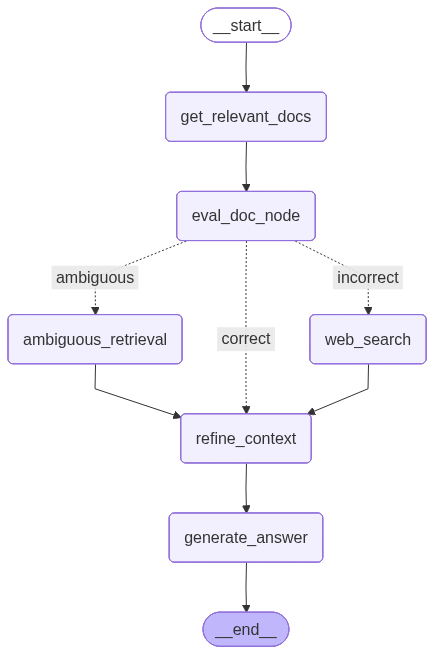

# Corrective RAG using LangGraph

A Corrective Retrieval-Augmented Generation (C-RAG) system built with LangGraph, LangChain, ChromaDB, Groq LLM, and Tavily Search.

The workflow evaluates retrieved documents and dynamically applies different retrieval strategies before generating a final answer.

---

## Architecture



---
### Retrieval Decisions

| Decision | Action |
|-----------|----------|
| Correct | Use retrieved documents |
| Ambiguous | Retrieve additional context |
| Incorrect | Perform web search using Tavily |

---

## Project Structure

```text
Corrective_RAG/
│
├── Corrective_RAG_Architecture.py   # LangGraph workflow
├── Rag_flow.py                      # Document retrieval
├── eval_doc_node.py                 # Retrieval evaluation
├── ambiguous_retrieval.py           # Ambiguous retrieval handling
├── web_search.py                    # Tavily web search
├── refine_context.py                # Context refinement & merging
├── generate_answer.py               # Final answer generation
├── llm.py                           # LLM configuration
├── state.py                         # Graph state definition
│
├── chroma_db/                       # Vector database
├── Leave-Policy.pdf                 # Sample knowledge base
│
├── requirements.txt
└── README.md
```

---

## Workflow

### 1. Retrieve Documents

`Rag_flow.py`

- Retrieves relevant documents from ChromaDB.

### 2. Evaluate Retrieval

`eval_doc_node.py`

Classifies retrieval quality as:

- Correct
- Ambiguous
- Incorrect

### 3.1 Corrective Retrieval
- Retrieved documnets are sufficient to generate the answer

### 3.2 Ambiguous Retrieval

`ambiguous_retrieval.py`

- Retrieved documents can't answer the question fully, so retrieved documents valid but still not sufficient

- additional information is collected from web search

- there relevant retrieved documents and wen search documents are combined and used for answer genration

### 3.3 Incorrect Retrieval

`web_search.py`

- Uses Tavily Search to fetch relevant web content.there web search documents are used to generate answers

### 4. Refine Context

`refine_context.py`

- Combines RAG documents and web search results.
- Produces the final context used by the LLM.

### 5. Generate Answer

`generate_answer.py`

- Generates the final response using the refined context.

---

## Tech Stack

- LangGraph
- LangChain
- ChromaDB
- Groq (Llama 3.3 70B)
- HuggingFace Embeddings
- Tavily Search
- Python

---

## Installation
Clone project from github
```bash
git clone https://github.com/ChanduAnnavarapu/Corrective_RAG.git
```
Open the project in VS Code and create virtual environment
```bash
python -m venv .venv
```
activate the virtual environment
```bash
.\.venv\Scripts\Activate
```
install the required packages using requirements.txt
```bash
pip install -r requirements.txt
```
Create `.env` file, by following env.template.txt
provide groq_api_key which is created in groq_cloud
provide the tavily_api_key

```env
API_KEY=<groq_api_key>
TAVILY_API_KEY=<tavily_api_key>
```

---

## Run

```bash
python Corrective_RAG_Architecture.py
```

Visualize the graph:

```python
from Corrective_RAG_Architecture import workflow
from IPython.display import Image, display

display(Image(workflow.get_graph().draw_mermaid_png()))
```

---

## Features

- Corrective RAG Architecture
- Dynamic Retrieval Evaluation
- Web Search Fallback
- Context Refinement
- Reduced Hallucinations
- LangGraph State Management

---

## Future Enhancements

- Query Rewriting
- Hybrid Search (BM25 + Vector Search)
- Source Citations
- Multi-Hop Retrieval
- Agentic RAG